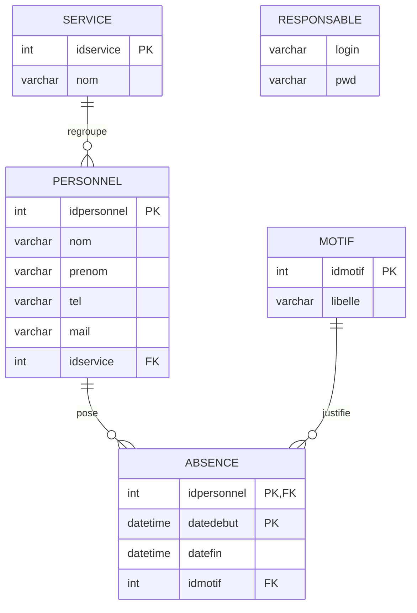
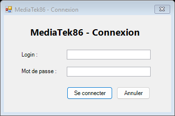
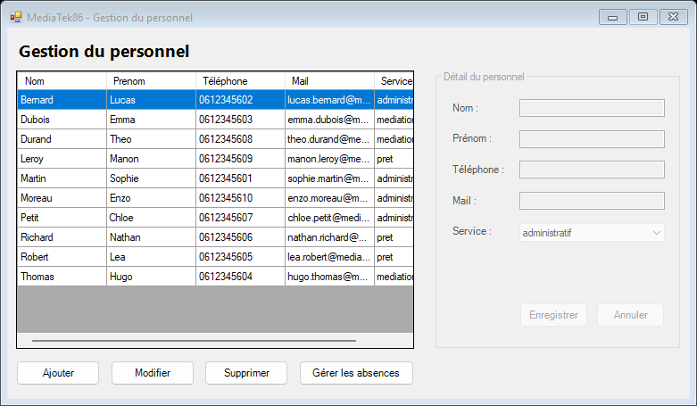
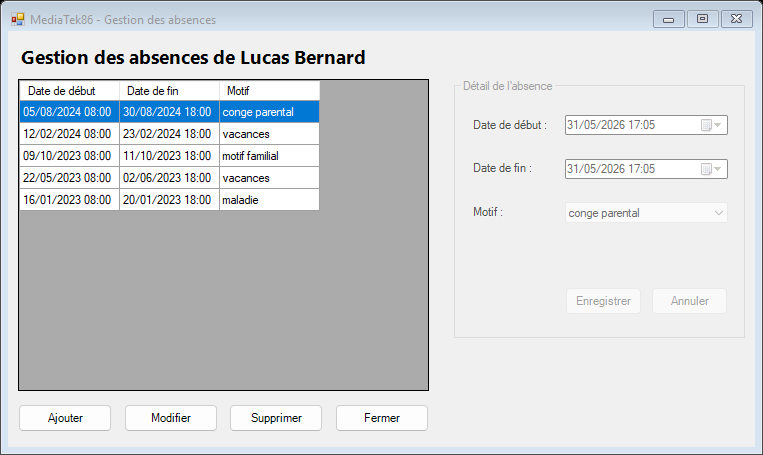
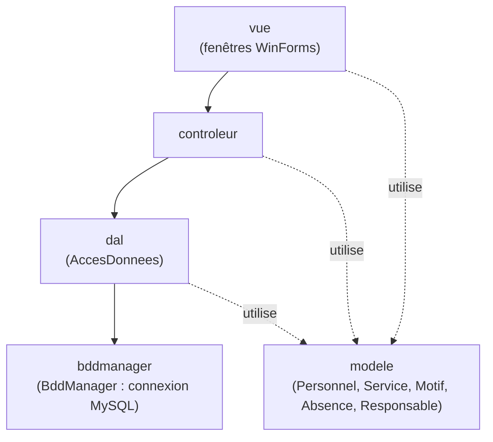

# MediaTek86 — Gestion du personnel et des absences

## 1. Présentation du contexte et but de l'application

La médiathèque **MediaTek86** souhaite informatiser le suivi de son personnel et de
ses absences. Le responsable du personnel a besoin d'une application de bureau pour :

- gérer les membres du personnel (consultation, ajout, modification, suppression) ;
- gérer les absences de chaque membre du personnel.

**MediaTek86** est une application de bureau développée en **C# / Windows Forms**
(.NET Framework 4.7.2), connectée à une base de données **MySQL**. L'accès est protégé
par une connexion (login / mot de passe) réservée au responsable.

### Modèle conceptuel des données (MCD)

Le fichier source du MCD (Looping) est versionné dans le dépôt : [`MediaTek86-mcd.loo`](MediaTek86-mcd.loo).



La table **RESPONSABLE** (login + mot de passe chiffré en SHA2 256 bits) sert uniquement
à l'authentification ; elle n'est reliée à aucune autre table.

## 2. Interfaces

### Connexion du responsable


### Gestion du personnel


### Gestion des absences


## 3. Diagramme de paquetages

L'application respecte l'architecture **MVC**. Le sens des appels va de la vue vers la
base de données :



| Paquetage | Rôle |
|---|---|
| `vue` | Interfaces graphiques (FrmConnexion, FrmGestionPersonnel, FrmGestionAbsence) |
| `controleur` | Liaison entre les vues et l'accès aux données |
| `dal` | Couche d'accès aux données : chaîne de connexion + requêtes SQL |
| `bddmanager` | Gestionnaire technique de la connexion MySQL (singleton) |
| `modele` | Classes métier correspondant aux tables |

## 4. Étapes de construction et commits

Le développement a été sauvegardé sur le dépôt distant en plusieurs étapes clairement
différenciées, chacune avec un commit commenté :

| Étape | Commit | Contenu |
|---|---|---|
| 1. Structure + Vue | `Initial: structure MVC et codage du visuel des interfaces (Vue)` | Création du projet WinForms, packages MVC, visuel des 3 fenêtres |
| 2. bddmanager / dal / modèle | `Ajout couches bddmanager (singleton) et dal, classes metiers et documentation technique (SHFB)` | Connecteur MySQL, BddManager, classes métier, doc technique SHFB |
| 3. DAL + contrôleur | `Couche d'acces aux donnees (DAL) et controleur` | Requêtes SQL (auth, CRUD) et méthodes du contrôleur |
| 4. CU Se connecter | `CU Se connecter : authentification du responsable` | Connexion sécurisée du responsable |
| 5. CU Gestion du personnel | `CU gestion du personnel : ajout, modification, suppression et acces aux absences` | CRUD personnel + accès aux absences |
| 6. CU Gestion des absences | `CU gestion des absences : affichage, ajout, modification et suppression` | CRUD des absences |
| 7. Documentation | `Mise a jour de la documentation technique (README)` | Mise à jour de la documentation |
| 8. Base de données | `Ajout du script SQL complet de la base au depot` | Script `create` + `insert` + utilisateur applicatif |
| 9. Anti-chevauchement | `Controle du chevauchement des absences` | Une absence ne peut plus en chevaucher une autre |
| 10. Déploiement | `Ajout de l'installeur (Inno Setup) et du README final` | Installeur + documentation finale |

Le suivi des tâches (kanban) est disponible sur le **GitHub Project** du dépôt, avec
toutes les étapes et cas d'utilisation.

## 5. Installation

### Pré-requis
- Windows 10 / 11.
- Un serveur **MySQL** (par exemple via **Wampserver**).

### a) Mise en place de la base de données
1. Démarrer le serveur MySQL (Wampserver).
2. Exécuter le script [`mediatek86.sql`](mediatek86.sql) en étant connecté en tant que
   `root` (via phpMyAdmin ou la console MySQL). Ce script :
   - crée la base `mediatek86` et toutes les tables ;
   - crée l'utilisateur applicatif `mediatek86user` avec les droits SELECT / INSERT /
     UPDATE / DELETE uniquement (accès sécurisé) ;
   - insère le responsable, les motifs, les services, 10 personnels et 50 absences.

   Exemple en ligne de commande :
   ```
   mysql -u root < mediatek86.sql
   ```

### b) Installation de l'application
1. Lancer l'installeur **`MediaTek86-Installeur.exe`** (dossier `Installeur/`).
2. Suivre l'assistant (choix du dossier, raccourcis).
3. Lancer l'application depuis le menu Démarrer ou le raccourci créé.

### c) Connexion
- Login : **admin**
- Mot de passe : **mediatek86**

> Si l'application affiche une erreur de connexion à la base, vérifier que le serveur
> MySQL est démarré et que l'utilisateur `mediatek86user` existe bien
> (la chaîne de connexion se trouve dans `dal/AccesDonnees.cs`).

## 6. Documentation technique

La documentation technique générée (SandCastle Help File Builder) est disponible dans
[`Documentation/Documentation-technique.zip`](Documentation/Documentation-technique.zip).
